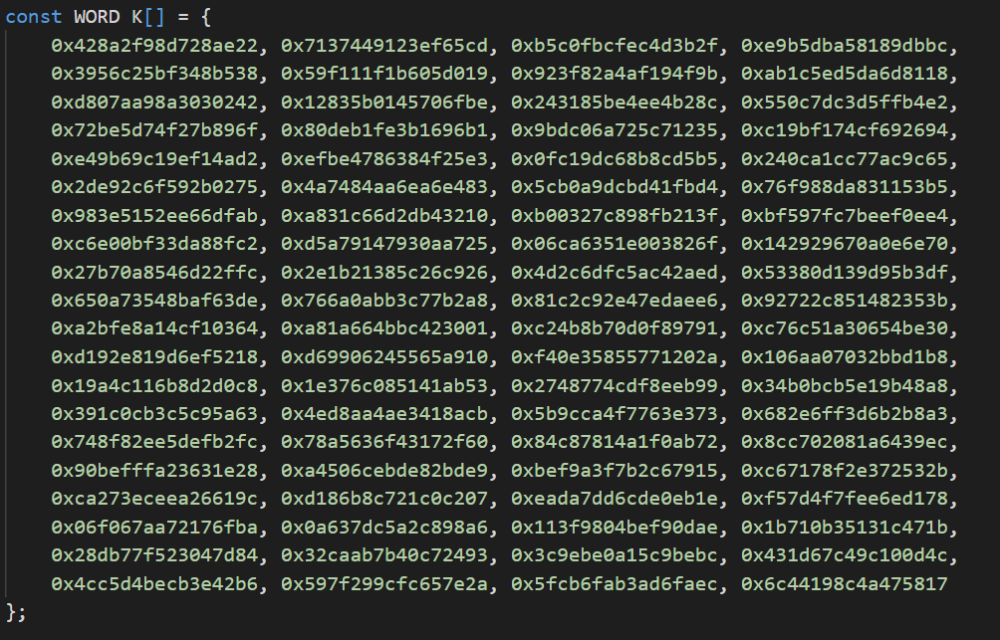

<h2 align="center">
    SHA512 Calculator
</h3>

<h3 align="center">
    A program written in C that calculates the SHA512 of an input file
</h4>

<p align="center">
  
</p>

## Project Details
Heading  | Details
-------- | -------------------------------------
Project  | [Project Spec](https://github.com/ianmcloughlin/theory-algos-project)
Course   | BSc (Hons) in Software Development
Module   | Theory of Algorithms
Author   | Grace Keane 
ID       | G00359990
Lecturer | Dr Ian McLoughlin

## Contents
- [Repository Description](#repository-description)
- [SHA512 Overview](#sha512-overview)
- [Software Requirements](#software-requirements)
- [Command Line Installations](#command-line-installations)
- [Running the Program](#running-the-program)
- [Project Implementation](#project-implementation)
- [Assignment Questions](#assignment-questions)
- [Referances](#referances)

## Repository Description

```bash
├── Images # Folders contains images discussed in README.md
│   ├──  # Image 1
│   └──  # Image 2
│   └──  # Image 3
│   └──  # Image 4
├── Screencasts # Folder containing screencasts of how to set-up, deploy and run project
│   ├── # Screencast 
├── .gitignore # Text file listing files to ignore
├── README.md # Full overview of project
├── argc.c # File containing C code for testing lab exercices)
├── bitoperations.c # File containing C code from lab exercices)
├── SHA512.c # SHA512 algorithm coded using C programming language
├── Test.c # Relevant testing of the SHA512 algorithm
├── Preproc.c # Code to take in an input file
├── input.txt # Input file

```

## SHA512 Overview
There are numerous secure hash algorithms such as the SHA-1, SHA-224, SHA-256, SHA-384, SHA-512, SHA-512/224 and SHA-512/256. These are used for computation of condensed representation of electronic data. When a message of any length  less than 2^64 bits (for SHA-1, SHA-224 and SHA-256) or less than 2^128 bits (for SHA-384, SHA-512, SHA-512/224 and SHA-512/256) is input to a hash algorithm. The result is a specific output also known as a message digest. These digests range in length from 160 to 512 bits, depending on the algorithm.

The hash algorithms have secure in their name because, for a given algorithm, it is computationally infeasible to find a message that corresponds to a given message digest or to find two different messages that produce the same message digest. Any change at all to a message will give a different result.

Explain & why is it important?

The SHA512 is part of a set of crytographic hash functions designed by the United States National Security (NSA) an published in 2001 [4]. The SHA512 is a hashing algorithm that performs a hashing function on given data such as an input file for this project. The final result of the SHA512  algorithm is a 512-bit message digest [3].

## Software Requirements
1. [Windows 10 Education (recommended)](https://www.microsoft.com/en-ie/education/products/windows) <br>
2. [WSL2 for Windows 10](https://docs.microsoft.com/en-us/windows/wsl/install-win10#manual-installation-steps)<br>
3. [Debian](https://www.microsoft.com/en-us/p/debian/9msvkqc78pk6?SilentAuth=1&wa=wsignin1.0&activetab=pivot:overviewtab) <br>
4. [Windows Terminal](https://www.microsoft.com/en-ie/p/windows-terminal/9n0dx20hk701?rtc=1&activetab=pivot:overviewtab)<br>
5. [Visual Studio Code](https://code.visualstudio.com/download)

## Command Line Installations
<b>In windows terminal:</b> <br>
Install make and gcc: ``` sudo apt install build-essential```<br>
ZSH shell: ``` sudo apt install zsh``` <br>
Nicer ZSH shell (optional): ``` sh -c "$(curl -fsSL https://raw.github.com/ohmyzsh/ohmyzsh/master/tools/install.sh)" ```

## Running the Program
1. In your command line terminal: ```git clone https://github.com/GraceKeane/theory-algos-project.git```<br>
2. Navigate to the <b> \program\ </b> directory: ```cd program```<br>
3. Compile the program: ```make SHA512```<br>
4. Execute the program: ```./SHA512```<br>

- Add screencasts to explain how to run & code snippets

## Project Implementation
### Creating the SHA512 functions
SHA512 uses six logical functions, where each function operates on 64-bit words, which are represented as x,y, and z. The result of each function is a new 64-bit word.

<b>Code snippet goes here</b>

### Declare SHA512 Constants
Declare a specific sequence of eighty constant 64-bit words. These words represent the first sixty-four bits of the fractional parts of the cube roots of the eighty prime numbers. 

<p align="center">
  
</p>

### Preprocessing - 1) Padding the message
Ensuring the message is a multiple of 1024 bits. The end of the padded message is a multiple of 1024 bits.  

<b>Code snippet goes here</b>

### Preprocessing - 2) Parsing the message into message blocks
The message and its padding are parsed into <i>N</i> 1024-bit blocks. Since the 1024 bits of the input block may be expressed as 64-bit words, the first 64 bits <i>i</i> are donated <i>M</i> to the power of <i>0(i)</i>, the next 64 bits are to the power of <i>1(i)</i> and so on until <i>15(i)</i>.

<b>Code snippet goes here</b>

### Preprocessing - 3) Setting the initial hash value
The initial hash value <i>H(0)</i> must be set. The size and number of words depends on the message digest. For SHA512 the initial hash value consists of the following eight 64-bit words, in hex. These words were obtained by taking the first 64 bits of the fractional parts of the square roots of the first eight prime numbers.

<b>Code snippet goes here</b>

## Assignment Questions 
<b>Why can't we reverse the SHA512 algorithm to retrieve the original message from a hash digest?</b><br>

<b>Can you design an algorithm that, given enough time, will find input messages that give each of the possible 512-bit strings?</b><br>

<b>How difficult is it to find a hash digest beginning with at least twelve zeros?</b><br>

## Referances
[1] GitHub, Markdown Cheetsheet, <br>
https://github.com/adam-p/markdown-here/wiki/ <br>
[2] dotcms, Markdown Syntax, <br>
https://dotcms.com/docs/latest/markdown-syntax <br>
[3] Secure Hash Standard, Quynh H. Dang, <br>
https://www.nist.gov/publications/secure-hash-standard <br>
[4] Wikipedia, SHA-2, <br>
https://en.wikipedia.org/wiki/SHA-2 <br>

